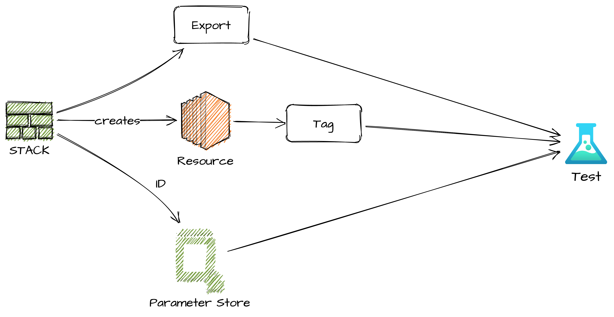

# CIT

CDK Infrastructure Testing

Project to support Intrastructure Testing with AWS CDK.

See [Blog1](https://aws-blog.de/2021/05/cit-build-cdk-infrastructure-testing-part-1-terratest-and-the-integrated-integration.html).

## Deploy

git tag <version>
git push mpa <version>

